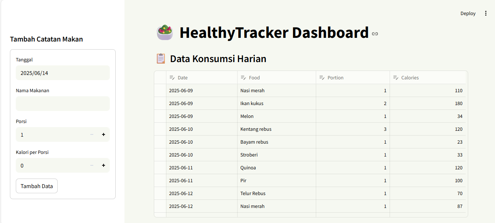

# HealthyTracker - Aplikasi Pemantau Gizi Harian

HealthyTracker adalah aplikasi berbasis Streamlit untuk mencatat konsumsi makanan harian dan melihat total kalori berdasarkan makanan atau tanggal.

## Fitur:
- Input makanan harian (tanggal, nama makanan, porsi, kalori)
- Edit langsung data dari dashboard
- Visualisasi grafik kalori per hari dan per makanan
- Penyimpanan data menggunakan Google Spreadsheet

## Setup Lokal
1. Clone repo ini
2. Tambahkan file `credentials.json` (Google Sheets API)
3. Jalankan:
```bash
pip install -r requirements.txt
streamlit run app.py

## 📷 Screenshot Aplikasi
### 🔸 Tampilan Form Input

